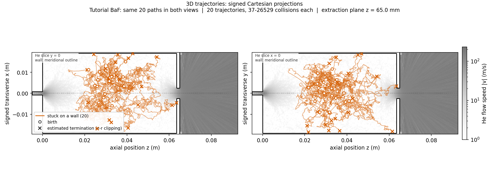

# 2D helium + molecule workflow: gotchas

Start with the [README](../README.md). This page explains the failure modes
that can produce a broken run or a plausible-looking but misread result. The
current entrypoints are [`tools/run_helium.sh`](../tools/run_helium.sh) and
[`tools/run_2d_standalone.sh`](../tools/run_2d_standalone.sh).

## Installation

- Run the shell workflow on Linux or inside an Ubuntu WSL terminal. A command
  entered in PowerShell will not have the expected paths or Linux tools. See
  [Windows/WSL2 setup](../README.md#getting-started-on-windows-wsl2).
- Use the pinned SPARTA build from
  [`build_sparta_plain.sh`](../tools/wsl/build_sparta_plain.sh). The B5 inlet
  needs `fix emit/surf ... mflow`, which older builds do not provide. Inspect
  the build first with `--print-plan`.
- The SPARTA build script protects existing build and install directories. Set
  fresh `SPARTA_BUILD_ROOT` and `SPARTA_INSTALL_ROOT` paths when rebuilding;
  do not erase an installation whose origin you have not checked.
- Set `SPARTA_PLAIN_EXE` in each new terminal. The run manifest records the
  executable hash and is the reliable identity of the solver used.
- Keep `tracer/Manifest.toml`, and invoke Julia with `--project=tracer`.
  Otherwise Julia can select a different package environment.
- Keep threaded math libraries at one thread per MPI rank. The helium runner
  checks its rank/thread budget, and the molecule runner refuses `THREADS`
  above `TRACER_THREAD_BUDGET`.

## Helium controls

The 4 SCCM B5 defaults in `run_helium.sh` have different jobs:

| Control | Meaning | Common mistake |
| --- | --- | --- |
| `MDOT=1.1905173e-8` | Continuing helium mass flow in kg/s | Treating the initial density as the flow control |
| `FILLN=2.3438e21` | Initial helium number density in m^-3 | Reporting it as a measured equilibrium density |
| `FNUM=2.5e17` | Simulation-particle number scale, combined with radial cell weighting | Treating it as a physical density |
| `DT=1e-7`, `STEPS=120000` | 12 ms of simulated time | Confusing simulated time with wall-clock runtime |
| `SEED=8675309` | Helium random seed | Reusing one seed as evidence of statistical convergence |

The analytic `FILLN` is printed by the
[geometry generator](../cases/b5-lean/gen_b5.py). It reduces the initial
transient; it does not prove equilibrium. The default run allows 10 ms for
settling. The [B5 deck](../cases/b5-lean/in.he_b5_mflow) saves a field every
20,000 steps, with each frame averaged over the preceding 20,000 steps. The
final 12 ms frame therefore represents the 10–12 ms window. This is practical
tutorial guidance, not an equilibrium, convergence, or uncertainty
certificate.

An installation check with `STEPS=2000` ends before the first field-averaging
interval. It leaves only the empty step-0 field, which the molecule runner
correctly rejects. Save at least one populated averaging window before tracing
molecules; the default 120,000-step run includes the tutorial settling interval.

Choose a new run name for every attempt. The runner refuses an existing output
directory. Parallel jobs with distinct names are allowed; divide CPU capacity
among them because the configurable thread budgets apply per job. A failed run
directory is still a useful diagnostic receipt; inspect `run.log`,
`rc.sentinel`, and `manifest.json` before starting under a new name.

## Axisymmetric geometry

The tutorial paths retain both transverse signs. Dashed lines mark the
projected centerline; circles mark births and crosses estimated terminations.

SPARTA coordinates are axial `x` and nonnegative radius `y`. The molecule
tracer uses Cartesian coordinates internally; the
[field converter](../tools/field2tracer.py) performs the mapping. Do not swap
columns or hand-edit `DS2FF.DAT`.

Trajectory figures show two projections of the same Cartesian 3D path:
axial `z` versus signed transverse `x`, and `z` versus signed `y`. A crossing
of one projected centerline is not necessarily a crossing of the 3D axis.
The helium background and walls are meridional slices, not the field sampled
along an off-plane path. Final markers use the existing radial-plane clipping
fraction interpolated onto the Cartesian terminal leg; they are estimated
terminations, not independently calculated 3D wall contacts. See the
[trajectory view guide](../README.md#reading-the-trajectory-views).

Edit geometry constants in `gen_b5.py`, regenerate the surfaces, and inspect
`git diff`. Do not edit generated `.surf` files independently. The generator
checks that walls and diagnostic stations avoid grid faces at every refinement
level used by the deck. Run
[`check_grid_2d.py`](../tools/check_grid_2d.py) on the finished `field.grid`
after changing the grid or geometry.

Surface direction and type matter. The cell loop is clockwise so its normal
faces the gas. The emitting cap has surface type 2, and the deck must read the
type column before forming the `cap` group. In `run.log`, confirm that the cap
group contains one surface and that `f_src[2]` increases.

The `tube_*` and `ap_*` surfaces are transparent counting stations. Never add
them to the wall geometry passed to the molecule tracer: the tracer treats
every supplied segment as a collision surface. The converter deliberately
uses only the run's `cell*.surf` geometry.

## Molecule source

Copy [`baf-hot-source.conf`](../cases/b5-lean/baf-hot-source.conf) before
changing it, then pass the copy as the molecule runner's third argument. A
changed species, cross section, source distribution, temperature, or
observation plane is a different result family.

The source file is data, not a shell script. Use one supported `KEY=value` per
line and put comments on separate lines. Unknown or missing keys are rejected.
`MASS_U` is in unified atomic mass units; other physical values are SI.
`SPAWN_R_M` is the radial source coordinate and `SPAWN_Z_M` is the axial
coordinate. `SPAWN_SIZE_M` is a Gaussian standard deviation for `gaussball`
and a sphere radius for `uniformball`.

Keep `SPAWN_CLIP=1` so candidate births are rejected when geometry separates
them from the source reference point. If clipping repeatedly rejects
candidates, fix the source position or size. Use a nonzero recorded `SEED`;
`SEED=0` leaves Julia's random state unpinned.

The included BaF configuration is an assumed initial distribution. The tracer
does not simulate ablation, chemistry, internal states, or molecule back-action
on helium. It propagates classical molecules through one frozen helium field
using the stated molecule-He collision model.

`Maximum iterations exceeded in sampling ...` comes from the table sampler's
rejection loop, which substitutes a fallback value. The current tracer builds
that table even with `SAMPLER=exact`; exact-mode collisions bypass it. With
`SAMPLER=table`, inspect these warnings before interpreting collision results.
They are written to `trace/tracer.stderr`, separately from bookkeeping checks.

## Outputs and field selection

Do not infer success from a plot. A helium or molecule run succeeds only when
`rc.sentinel` contains `0` and `manifest.json` says `complete`. Keep both run
directories: the molecule receipt identifies the tracer calculation, while
the helium receipt identifies the SPARTA calculation that made the field.

`field.grid` contains appended snapshots. The converter selects the latest
complete snapshot by default and ignores an unfinished trailing frame. Its
`--timestep` option requires an exact saved step; `--until-step` and `--until-ms`
select the latest complete frame at or before a limit. Choose at most one of
those three selectors. Time selection uses the
recorded `DT`, or an explicit `--dt` in seconds. See the
[mid-run examples](../README.md#inspect-a-run-while-it-continues).

The molecule runner accepts complete frames from running or failed helium
calculations and records the observed parent status. This permits exploration
without relabeling a parent calculation as successful. It freezes raw field,
geometry, and converted data under `field/`, so later helium output cannot
change its input or plot background. It rejects step 0 or a field with fewer
than 100 populated cells, as required by tracer interpolation.

A successful molecule directory also has a positive `source_timestep` in
`field/provenance.json` and exactly `N` data rows in `trace/spawn.csv`.
`commands.sh` records the converter, tracer, and analyzer commands. Generated
runs are ignored by Git, so keep or archive the result directories explicitly.

`N=1` and equal per-particle collision counts are valid. Runtime checks compare
actual hook legs with collision counts and test endpoint continuity; they do
not require a shuffled-record comparison to fail or impose a universal
statistical/convergence threshold.

## Reading the analysis

See [Controlling numerical accuracy](accuracy.md) for particle-count,
mesh/timestep, and sampling studies when a quantitative error target matters.

`exit.json` reports escape through the geometry-derived exit plane.
`common.json` reports first crossings of the configured observation plane and
applies explicit radius and angle cuts. For comparisons, keep the observation
plane, aperture radius, angular cut, source configuration, and denominator
fixed.

The accepted yield in `common.json` is `accepted particles / N launched
particles`, evaluated at the first forward crossing with positive axial
velocity. Its denominator is not conditional on reaching the plane.
`N_first`, `N_back`, `N_survive`, and `N_escape` are distinct counts; a
particle accepted at its first crossing can later cross back. `TRAJPRINT`
records every leg of the first requested particle indices, so those paths are
illustrations rather than an acceptance-selected sample.

The reported binomial standard error covers the finite molecule draw on one
frozen helium field. It excludes helium-field variation, source uncertainty,
grid and timestep error, collision-model error, and experimental acceptance
uncertainty. Increasing `N` reduces only the first contribution. Compare saved
helium fields and run numerical controls before using the tutorial output for
a quantitative physics claim.
